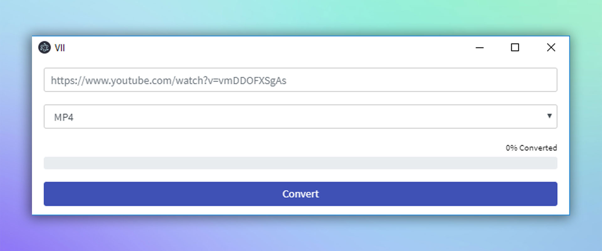

# VII


> It allows you to download high quality video and audio over Youtube. The video or audio you want to download will be downloaded at the highest quality it supports.




## Format Support

```sh
Audio
  MP3
Video
  MP4
  FLV
```

## Quality Support


> By default, the video and audio you want to download is downloaded at the highest quality it supports. The higher the size of the video or audio file you want to download, the longer it will take to download.


## Install

```sh
git clone https://github.com/ardagedikk/VII.git
cd VII
npm install
```

## Run

```sh
npm start
```

## Build

Build the application for specified or all platform:

```sh
npm run release-windows
npm run release-linux
npm run release-mac

npm run release-linux deb
npm run release-linux rpm
```


## License

MIT
